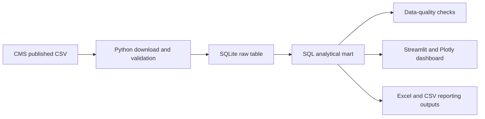

# Part D Atlas — Medicare Drug Cost & Prescribing Analytics

A reproducible Python, SQL, Streamlit, and Plotly project built from a published CMS public-use dataset. No synthetic records are used.

## Business questions

- Which drugs account for the highest published Medicare Part D drug cost?
- How do claim volume and cost per claim vary across drugs?
- Which states have the highest aggregate costs and utilization?
- What share of costs and claims is associated with CMS-flagged opioid drugs?

## Published data source

- **Publisher:** Centers for Medicare & Medicaid Services
- **Dataset:** [Medicare Part D Prescribers — by Geography and Drug](https://data.cms.gov/provider-summary-by-type-of-service/medicare-part-d-prescribers/medicare-part-d-prescribers-by-geography-and-drug)
- **Data year:** 2024
- **Access:** Public-use file; U.S. government data
- **Version ID:** `9b4c142c-69cc-4a96-a09a-7cf2ba7f5816`

The pipeline records the exact download URL, timestamp, file size, and SHA-256 checksum in `data/raw/source_metadata.json`.

## Architecture



## Run locally

```bash
python -m venv .venv
.venv\Scripts\activate
pip install -r requirements.txt
python scripts/run_pipeline.py
pytest
streamlit run streamlit_app.py
```

## Dashboard views

- **Executive Summary:** national claims, cost, standardized fills, cost per claim, top drugs, and leading states.
- **Drug Analysis:** high-cost drugs, utilization-versus-cost analysis, CMS opioid flags, and detailed rankings.
- **State Comparison:** U.S. choropleth and sortable state metrics.
- **Data Quality & Methodology:** SQL checks, source provenance, definitions, and interpretation limits.

## Verified 2024 results

- 117,661 published source rows loaded into SQLite.
- 1.711 billion national claims and $288.57 billion in total drug cost.
- $168.65 national cost per claim.
- Eliquis has the highest published national drug cost at $20.77 billion.
- One published row has a missing geography code. It is preserved, flagged by two warning checks, and excluded from geographic summaries.

## Repository structure

```text
src/                 Download, validation, transformation, and query code
sql/                 Analytical model and data-quality checks
tests/               Unit and production-data tests
docs/                Methodology, dictionary, limitations, and executive summary
data/raw/             Downloaded CMS source (ignored by Git)
data/processed/       SQLite analytical database (ignored by Git)
outputs/              Client reporting exports
streamlit_app.py      Interactive dashboard
```

## Critical interpretation limits

This file is aggregated by geography and drug. It does not contain patient-level claims, diagnoses, adherence measures, rebates, or causal evidence. Beneficiary counts may be suppressed and cannot be summed across drugs as unique people. Total drug cost includes multiple payment sources and is not Medicare-only spending.

See [methodology](docs/methodology.md), [data dictionary](docs/data_dictionary.md), and [limitations](docs/limitations.md).
